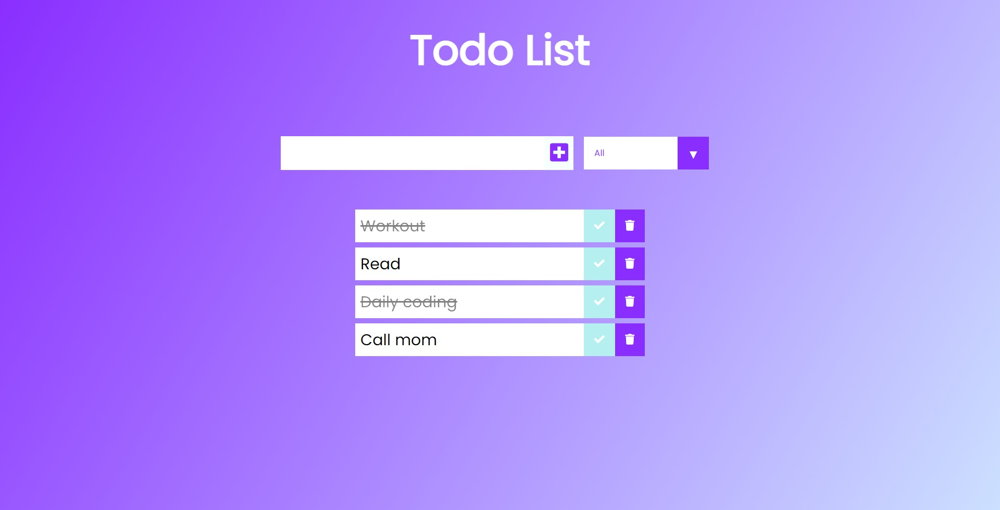

# Ract Todo App 🔥🔥🔥

  This project is a simple react application "Todo list" where you can add or delete todos also marke the completed ones as complete 

## How to use 🤷‍♀️🤷‍♀️🤷‍♀️

You can just add whatever task you have if it's done mark the task as complete you can also display the completed, uncompleted or all the task you have in your todo list

